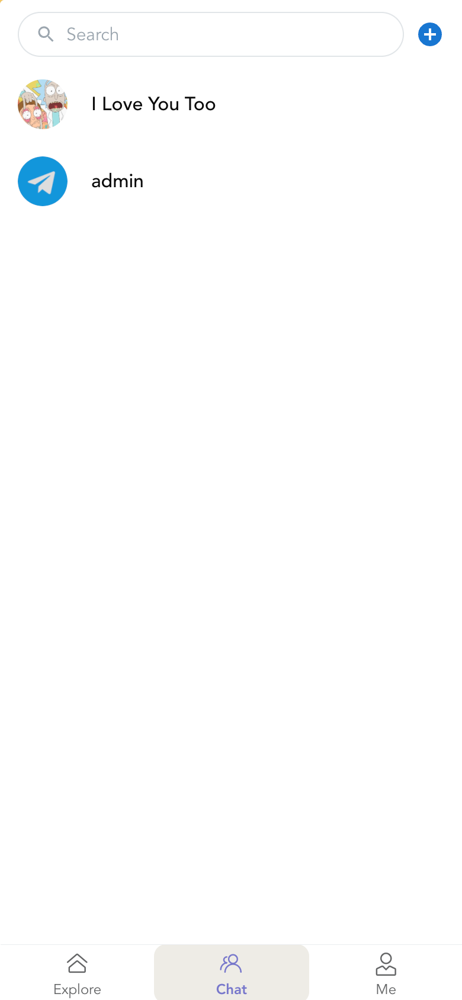

# WeDate
A decentralized social app for dating.

## Tech
moralis + vue3

## Setup
Edit `src/store/memory.ts`

```javascript
Moralis.start({
    serverUrl: '',
    appId: '',
    masterKey: '',
});
```

## UI


___


___


___


___



___


## Online Demo
I won't publish it since the free `moralis` server can't be used to serve a lot of people.